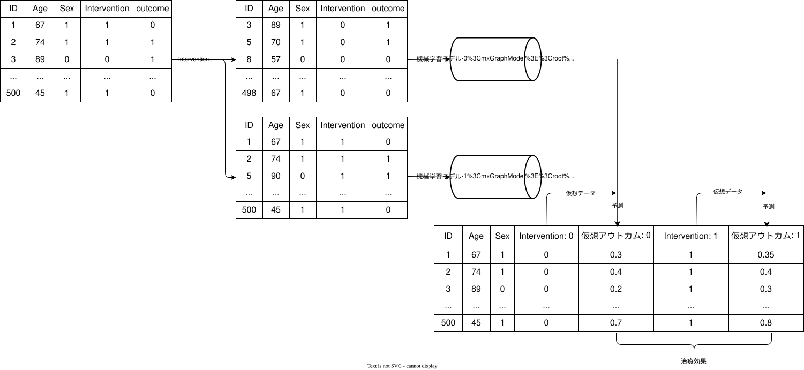
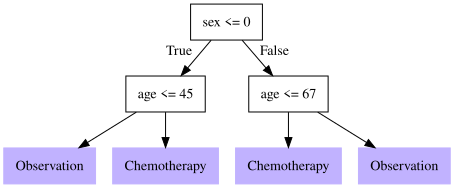

```{python}
#| label: data-loading


import pandas as pd

lalonde = (
    pd.read_csv("rawdata/lalonde.csv")
    .pipe(pd.get_dummies, columns=["race"], drop_first=True, dtype=int)
)

```

# 因果推論 at glance

## 因果関係

- 医学研究の第一の目標と言っても過言ではない
- Aの薬を使うと患者の予後は良くなるか？
- 実際は口で言うほど簡単ではない

## 因果関係の考え方

- 大きく分けて2つの考え方がある
  - 潜在的アウトカムを考えるRubin流
  - DAGを作り、do operatorを使うPearl流
- 詳細は省くが、今回はPearl流のDAGを中心に考える

## DAGの基本

```{r}
#| label: DAG
#| fig-width: 10
#| fig-height: 4

library(dagitty)
library(ggdag)
library(dplyr)
library(ggplot2)
library(grid)

dag <- dagitty("dag {
  D -> A
  A -> B
  B -> C
  D -> C
  A -> E
  C -> E
}")

# Graphviz版の見た目に合わせて座標を固定
coordinates(dag) <- list(
  x = c(A = 1, B = 4, C = 7, D = 4, E = 4),
  y = c(A = 0, B = 0, C = 0, D = -1, E = 1)
)

labels_ja <- c(
  A = "曝露",
  B = "中間因子",
  C = "アウトカム",
  D = "交絡因子",
  E = "Collider"
)

tidy_dagitty(dag) |>
  mutate(
    label = labels_ja[name],
    label_x = if_else(name == "C", x + 0.05, x),
    label_y = y
  ) |>
  ggplot(aes(x = x, y = y, xend = xend, yend = yend)) +
  geom_dag_edges(
    arrow_directed = grid::arrow(length = grid::unit(8, "pt"), type = "closed")
  ) +
  geom_dag_point(size = 32, alpha = 0.2, color = "#2C7FB8") +
  geom_dag_text(aes(x = label_x, y = label_y, label = label), size = 4, color = "black") +
  theme_dag() +
  coord_equal(xlim = c(0, 8), ylim = c(-1.5, 1.5), clip = "off")


```

## 通常の統計学的手法

- 通常は交絡因子の調整により因果関係を推測する


## 交絡因子の調整の方法

- 回帰
- Matching
- 層別化

## 例えば単純な回帰だと

```{r}
#| label: simple-regression
#| results: asis

library(MatchIt)
library(easystats)
library(modelsummary)

lalonde <- MatchIt::lalonde

fit_ols = lm(re78 ~ treat + age + educ + race + married + nodegree + re74 + re75, data = lalonde)

modelsummary::modelsummary(
  fit_ols
  
  )

```

## Matchingだと

- 一番有名なのはPropensity score matching

```{r}
#| label: propensity-score-analysis

library(MatchIt)
library(WeightIt)
library(marginaleffects)
library(modelsummary)

mout <- MatchIt::matchit(treat ~ age + educ + race + married + nodegree + re74 + re75, data = lalonde)

m_dat <- MatchIt::match.data(mout)

fit_match <- lm(re78 ~ treat * (age + educ + race + married + nodegree + re74 + re75), data = m_dat)

match_res <- marginaleffects::avg_comparisons(
  fit_match, 
  variable = "treat", 
  vcoc = ~subclass, 
  newdata = subset(treat == 1)
)

wout <- WeightIt::weightit(treat ~ age + educ + race + married + nodegree + re74 + re75, data = lalonde, method = "ipt")

weight_res <- WeightIt::lm_weightit(
  re78 ~ treat, 
  data = lalonde, 
  weightit = wout, 
  vcov = "HC0"
)

options("modelsummary_factory_default" = "tinytable")

modelsummary::modelsummary(
  models = list(
    `PS match` = match_res, 
    `PS weight` = weight_res
    ), 
  estimate = "{estimate} [{conf.low}, {conf.high}]"

)

```


## Doubly robust estimation 

```{r}
library(WeightIt)

ps_fit <- glm(treat ~ age + educ + race + married + nodegree + re74 + re75, data = lalonde, family = binomial)

ps_trimmed <- predict(ps_fit, type = "response") |> 
  (\(x)dplyr::case_when(
    x < 0.01 ~ 0.01, 
    x > 0.99 ~ 0.99, 
    .default = x
  ))()


WeightIt::weightit(treat ~ age + educ + race + married + nodegree + re74 + re75, data = lalonde, method = "glm") |> 
  WeightIt::trim(at = 0.95)

```


```{python}
#| label: AIPW


import numpy as np
import pandas as pd
import statsmodels.formula.api as smf

# 1) load + dummies (method chain)


Y = "re78"
T = "treat"
X = ["age", "educ", "married", "nodegree", "re74", "re75", "race_hispan", "race_white"]
rhs = " + ".join(X)

# 2) Propensity model: logistic regression
ps_fit = smf.logit("treat ~ age + educ + married + nodegree + re74 + re75 + race_hispan + race_white", data=lalonde).fit(disp=0)
e_hat = ps_fit.predict(lalonde).clip(1e-3, 1 - 1e-3)  # stabilize

# 3) Outcome models: treated / control separately
mu1_fit = smf.ols("re78 ~ treat + age + educ + married + nodegree + re74 + re75 + race_hispan + race_white", data=lalonde.query("treat == 1")).fit()
mu0_fit = smf.ols("re78 ~ treat + age + educ + married + nodegree + re74 + re75 + race_hispan + race_white", data=lalonde.query("treat == 0")).fit()

mu1_hat = mu1_fit.predict(lalonde)
mu0_hat = mu0_fit.predict(lalonde)

# 4) AIPW score (ATE)
phi = (
    (mu1_hat - mu0_hat)
    + lalonde[T] * (lalonde[Y] - mu1_hat) / e_hat
    - (1 - lalonde[T]) * (lalonde[Y] - mu0_hat) / (1 - e_hat)
)

ate_dr = phi.mean()
se_dr = phi.std(ddof=1) / np.sqrt(len(lalonde))
ci95 = (ate_dr - 1.96 * se_dr, ate_dr + 1.96 * se_dr)

print(f"DR ATE: {ate_dr:.2f}")
print(f"SE: {se_dr:.2f}")
print(f"95% CI: ({ci95[0]:.2f}, {ci95[1]:.2f})")


```

## TMLE 

```{python}
#| label: TMLE

# library(readr)
# library(tmle)
# library(WeightIt)


import numpy as np
import pandas as pd
import statsmodels.api as sm
import statsmodels.formula.api as smf
from scipy.special import expit, logit

lalonde = (
    pd.read_csv("rawdata/lalonde.csv")
    .pipe(pd.get_dummies, columns=["race"], drop_first=True, dtype=int)
)

# ------------------------------------------------------------
# 2. define outcome
# ------------------------------------------------------------
Y = lalonde["re78"].to_numpy(dtype=float)
A = lalonde["treat"].to_numpy(dtype=float)

# ------------------------------------------------------------
# 3. propensity score model g(A|W)
#    Rの式にかなり近い形
# ------------------------------------------------------------
g_formula = "treat ~ age + educ + race_hispan + race_white + married + nodegree + re74 + re75"
g_fit = smf.logit(g_formula, data=lalonde).fit(disp=False)

g1W = g_fit.predict(lalonde)
g1W = np.clip(g1W, 1e-6, 1 - 1e-6)
g0W = 1 - g1W

# ------------------------------------------------------------
# 4. initial outcome regression Q(A,W) = E[Y|A,W]
#    まずは単純な main effect model
# ------------------------------------------------------------
Q_formula = "re78 ~ treat + age + educ + race_hispan + race_white + married + nodegree + re74 + re75"
Q_fit = smf.ols(Q_formula, data=lalonde).fit()

# observed Q(A,W)
QAW = Q_fit.predict(lalonde)

# counterfactual predictions
df1 = lalonde.copy()
df1["treat"] = 1
Q1W = Q_fit.predict(df1)

df0 = lalonde.copy()
df0["treat"] = 0
Q0W = Q_fit.predict(df0)


# ------------------------------------------------------------
# 5. scale outcome to (0,1)
#    logistic fluctuation のため
# ------------------------------------------------------------
y_min = Y.min()
y_max = Y.max()

def to_unit(x, xmin, xmax, eps=1e-6):
    z = (x - xmin) / (xmax - xmin)
    return np.clip(z, eps, 1 - eps)

def from_unit(z, xmin, xmax):
    return z * (xmax - xmin) + xmin

Y_s   = to_unit(Y,   y_min, y_max)
QAW_s = to_unit(QAW, y_min, y_max)
Q1W_s = to_unit(Q1W, y_min, y_max)
Q0W_s = to_unit(Q0W, y_min, y_max)

# ------------------------------------------------------------
# 6. clever covariate
# ------------------------------------------------------------
H = A / g1W - (1 - A) / g0W

# fluctuation用データ
df_fluct = pd.DataFrame({
    "Y_s": Y_s,
    "H": H,
    "offset_q": logit(QAW_s)
})

# ------------------------------------------------------------
# 7. fluctuation step
#    logit(Q*) = logit(Q) + epsilon * H
#    切片なしにしたいので "0 + H"
# ------------------------------------------------------------
fluct_fit = smf.glm(
    formula="Y_s ~ 0 + H",
    data=df_fluct,
    family=sm.families.Binomial(),
    offset=df_fluct["offset_q"]
).fit()

epsilon = fluct_fit.params["H"]

# updated predictions on scaled scale
QAW_star_s = expit(logit(QAW_s) + epsilon * H)
Q1W_star_s = expit(logit(Q1W_s) + epsilon * (1 / g1W))
Q0W_star_s = expit(logit(Q0W_s) + epsilon * (-1 / g0W))

# back-transform to original re78 scale
QAW_star = from_unit(QAW_star_s, y_min, y_max)
Q1W_star = from_unit(Q1W_star_s, y_min, y_max)
Q0W_star = from_unit(Q0W_star_s, y_min, y_max)

# ------------------------------------------------------------
# 8. TMLE estimate
# ------------------------------------------------------------
psi_tmle = np.mean(Q1W_star - Q0W_star)

# ------------------------------------------------------------
# 9. influence curve, SE, CI
# ------------------------------------------------------------
IC = H * (Y - QAW_star) + (Q1W_star - Q0W_star) - psi_tmle
se_tmle = IC.std(ddof=1) / np.sqrt(len(IC))
ci_low = psi_tmle - 1.96 * se_tmle
ci_high = psi_tmle + 1.96 * se_tmle

print("TMLE ATE (re78 scale):", psi_tmle)
print("SE:", se_tmle)
print("95% CI:", (ci_low, ci_high))
print("epsilon:", epsilon)


```

## ここらへんの問題

- Misspecificationの問題
- Estimandの問題 = 治療効果の異質性

# 機械学習 at glance


## 機械学習とは


## 代表的な機械学習

- Logistic回帰
- tree-based model
  - Random forest
  - XGBoost
- Neural network


## 機械学習の強み

## 疑問

- 機械学習を用いて因果関係を推測出来るんじゃないか？

## 機械学習を用いた因果推論のPros and Cons

- Pros
  - モデルのMisspecificationを避けられる
  - 因果関係の異質性を柔軟に捉えられる
- Cons
  - Overfittingの問題
  - 解釈が難しい時がある
  - 信頼区間が出しにくい
    
```{python}
#| label: S-learner

from econml.metalearners import SLearner
import numpy as np
import pandas as pd 
from sklearn.ensemble import GradientBoostingRegressor
from sklearn.model_selection import train_test_split

X = lalonde.loc[:,["age", "married", "educ", "nodegree", "re74", "re75", "race_hispan", "race_white"]]
y = lalonde['re78']
T = lalonde['treat']
n = lalonde.shape[0]

X_train, X_test, y_train, y_test = train_test_split(
    X, 
    y, 
    test_size=0.2, 
    random_state=42, 
    stratify=T
    )

T_train = T.loc[y_train.index]
T_test = T.loc[y_test.index]

# Instantiate S learner
overall_model = GradientBoostingRegressor(n_estimators=100, max_depth=6, min_samples_leaf=int(491/100))
S_learner = SLearner(overall_model=overall_model)
# Train S_learner
S_learner.fit(y_train, T_train, X=X_train)
# Estimate treatment effects on test data
S_te = S_learner.effect(X_test)

print(S_te)

```

## Scratch for S-learner

```{python}
#| label: scratch-for-S-learner


import numpy as np
import pandas as pd
import lightgbm as lgb
from sklearn.datasets import load_breast_cancer
from sklearn.model_selection import train_test_split
from sklearn.metrics import root_mean_squared_error


lalonde = (
    pd.read_csv("rawdata/lalonde.csv")
    .pipe(pd.get_dummies, columns=["race"], drop_first=True, dtype=int)
)
# 1. データセットの読み込み
# ここでは例としてscikit-learnの乳がんデータセットを使用します
X = lalonde.loc[:,["treat", "age", "married", "educ", "nodegree", "re74", "re75", "race_hispan", "race_white"]]
y = lalonde['re78']
n = lalonde.shape[0]


# 2. データを学習用（80%）とテスト用（20%）に分割
X_train, X_test, y_train, y_test = train_test_split(
    X, y, test_size=0.2, random_state=42
)

# 3. モデルの初期化 (scikit-learn API)
# 引数を指定しない場合、デフォルトのハイパーパラメータが適用されます
model = lgb.LGBMRegressor(
  random_state=42, 
  verbosity = -1)

# 4. モデルの学習 (fit)
print("モデルの学習を開始します...")
model.fit(X_train, y_train)
print("学習が完了しました。")

# 5. テストデータでの予測と評価（おまけ）
y_pred = model.predict(X_test)

y_true = [3, -0.5, 2, 7]
y_pred = [2.5, 0.0, 2, 8]
rmse = root_mean_squared_error(y_true, y_pred)

print(f"テストデータのRMSE: {rmse:.4f}")


pred_0 = model.predict(X.assign(treat = 0))
pred_1 = model.predict(X.assign(treat = 1))
te = np.mean(pred_1 - pred_0)

print(f"平均処置効果の推定値: {te:.4f}")

X_s_learn = (
    lalonde
    .loc[:,["treat", "age", "married", "educ", "nodegree", "re74", "re75", "race_hispan", "race_white", "re78"]]
    .assign(
        treat_0 = 0,
        effect_0 = pred_0, 
        treat_1 = 1, 
        effect_1 = pred_1,
        treat_effect = pred_1 - pred_0
    ) 
)

X_s_learn.head()


```

## T learner





## Scratch for T-learner


```{python}
#| label: T-learner


from econml.metalearners import TLearner
import numpy as np
import pandas as pd 
from sklearn.ensemble import GradientBoostingRegressor
from sklearn.model_selection import train_test_split

X = lalonde.loc[:,["age", "married", "educ", "nodegree", "re74", "re75", "race_hispan", "race_white"]]
y = lalonde['re78']
T = lalonde['treat']
n = lalonde.shape[0]

X_train, X_test, y_train, y_test = train_test_split(
    X, 
    y, 
    test_size=0.2, 
    random_state=42, 
    stratify=T
    )

T_train = T.loc[y_train.index]
T_test = T.loc[y_test.index]

# Instantiate T learner
models = GradientBoostingRegressor(n_estimators=100, max_depth=6, min_samples_leaf=int(n/100))
T_learner = TLearner(models=models)
# Train T_learner
T_learner.fit(y_train, T_train, X=X_train)
# Estimate treatment effects on test data
T_te = T_learner.effect(X_test)

print("T learnerでの局所治療効果")
print(T_te)

```

```{python}
#| label: meta-learner


# Main imports
from econml.metalearners import TLearner, SLearner, XLearner, DomainAdaptationLearner

# Helper imports
import numpy as np
import pandas as pd
from numpy.random import binomial, multivariate_normal, normal, uniform
from sklearn.ensemble import RandomForestClassifier, GradientBoostingRegressor
from sklearn.model_selection import train_test_split

X = lalonde.loc[:,["age", "married", "educ", "nodegree", "re74", "re75", "race_hispan", "race_white"]]
y = lalonde['re78']
T = lalonde['treat']
n = lalonde.shape[0]

X_train, X_test, y_train, y_test = train_test_split(
    X, 
    y, 
    test_size=0.2, 
    random_state=42, 
    stratify=T
    )

T_train = T.loc[y_train.index]
T_test = T.loc[y_test.index]

# Instantiate X learner
models = GradientBoostingRegressor(n_estimators=100, max_depth=6, min_samples_leaf=int(n/100))
propensity_model = RandomForestClassifier(n_estimators=100, max_depth=6,
                                                  min_samples_leaf=int(n/100))
X_learner = XLearner(models=models, propensity_model=propensity_model)
# Train X_learner
X_learner.fit(y_train, T_train, X=X_train)
# Estimate treatment effects on test data
X_te = X_learner.effect(X_test)

# Instantiate Domain Adaptation learner
models = GradientBoostingRegressor(n_estimators=100, max_depth=6, min_samples_leaf=int(n/100))
final_models = GradientBoostingRegressor(n_estimators=100, max_depth=6, min_samples_leaf=int(n/100))
propensity_model = RandomForestClassifier(n_estimators=100, max_depth=6,
                                                  min_samples_leaf=int(n/100))
DA_learner = DomainAdaptationLearner(models=models,
                                     final_models=final_models,
                                     propensity_model=propensity_model)
# Train DA_learner
DA_learner.fit(y_train, T_train, X=X_train)
# Estimate treatment effects on test data
DA_te = DA_learner.effect(X_test)

# Instantiate Doubly Robust Learner
from econml.dr import DRLearner
outcome_model = GradientBoostingRegressor(n_estimators=100, max_depth=6, min_samples_leaf=int(n/100))
pseudo_treatment_model = GradientBoostingRegressor(n_estimators=100, max_depth=6, min_samples_leaf=int(n/100))
propensity_model = RandomForestClassifier(n_estimators=100, max_depth=6,
                                                  min_samples_leaf=int(n/100))

DR_learner = DRLearner(model_regression=outcome_model, model_propensity=propensity_model,
                       model_final=pseudo_treatment_model, cv=5)
# Train DR_learner
DR_learner.fit(y, T, X=X)
# Estimate treatment effects on test data
DR_te = DR_learner.effect(X_test)

```
## 機械学習の因果推論における使い方

- 交絡因子の調整で機械学習を用いる
  - AIPW, tlmeなど
- 因果をダイレクトに推論する学習機を作る
  - Meta-learner
- CATEを測定する
  - Causal forestなど

## 因果forest

- HTEを計測するのに有名
- Ashey et al 2019


## Survival model

```{r}
#| label: survival-model

library(tidyverse)
library(survival)
library(grf)
library(policytree)

colon_prep <- survival::colon |> 
  dplyr::mutate(
    rx_bin = dplyr::if_else(rx == "Obs", 0, 1)
  ) |> 
  tidyr::drop_na()

head(colon)

survfit_grf <- grf::causal_survival_forest(
  X = colon_prep[, c("age", "sex", "obstruct", "perfor", "adhere", "nodes", "differ", "extent", "surg")],
  Y = colon_prep$time, 
  W = colon_prep$rx_bin, 
  D = colon_prep$status, 
  target = "RMST", 
  horizon = 365*5
  )

Gamma.matrix <- double_robust_scores(survfit_grf)

head(Gamma.matrix)

surv_tree <- policytree::policy_tree(
  colon_prep[, c("age", "sex", "obstruct", "perfor", "adhere", "nodes", "differ", "extent", "surg")], 
  Gamma.matrix, 
  depth = 2
)

# plot(surv_tree, leaf.labels = c("Observation", "Chemotherapy"))

# base plot は knitr が各出力形式向けに自動処理する


plot(surv_tree, leaf.labels = c("Observation", "Chemotherapy"))
# cat(DiagrammeRsvg::export_svg(surv_tree_plot), file = here::here("figure_list", 'treeplot.svg'))

```
<!--  -->

